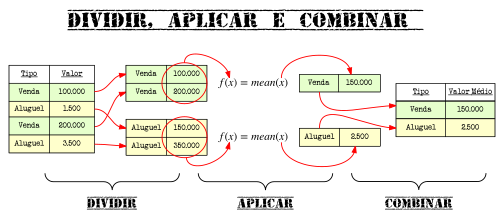

```{r, echo = FALSE}
setwd("~/Dropbox/R/livroR/DAC")
dados <- readRDS("Dados/dados.rds")
dados <- na.omit(dados)
dados$pm2 <- dados$preco / dados$m2
# filtro para venda
ok.venda <- with(dados, tipo=="venda" & 
                         pm2 > 3000 & 
                         pm2 < 20000)

# filtro para aluguel
ok.aluguel <- with(dados, tipo=="aluguel" & 
                           pm2 > 25 & 
                           pm2 < 100)
# juntando os dois
ok <- (ok.venda | ok.aluguel)
library(stringr)
dados$bairro <- str_trim(dados$bairro)
ok <- ok & dados$bairro %in% c("Asa Sul", "Asa Norte", "Sudoeste", "Noroeste", "Lago Sul", "Lago Norte")
# separando outliers e limpos
outliers <- dados[!ok,]
dados <- dados[ok,]
```

# Dividir, Aplicar e Combinar

## Um padrão recorrente
Nossa base de dados contém preços tanto de aluguel quanto de venda de apartamentos. Suponha que queiramos tirar a médias dos preços. Não faz muito sentido tirar a média dos dois tipos (aluguel e venda) juntos, certo? Como poderíamos fazer isso então? Uma possível solução seria a seguinte:

Primeiramente, dividimos a base de dados, criando duas outras, uma para cada grupo: aluguel e venda.

```{r}
# 1) separar a base em duas bases diferentes:
#    - aluguel; e, 
#    - venda
aluguel <- dados[dados$tipo == "aluguel", ]
venda <- dados[dados$tipo == "venda", ]
```

Em seguida nós calculamos a média para cada uma das novas bases que criamos.

```{r}
# 2) calcular a média para cada uma das bases
media_aluguel <- mean(aluguel$preco)
media_venda   <- mean(venda$preco)
```
Por fim, nós combinamos os resultados em um único vetor:

```{r}
# 3) combinar os resultados em um único vetor
medias = c(aluguel = media_aluguel, venda = media_venda)
medias
```

Pronto! Calculamos as duas médias que queríamos. Todavia, note que gastamos cerca de 5 linhas para chegar ao resultado - e que foram 5 linhas porque temos apenas 2 categorias (alguel e venda) neste exemplo. Imagine se tívessemos que analisar separadamente 200 ou 2000 categorias? Teríamos que criar uma base separada para cada uma delas? 

Não necessariamente. Na verdade podemos fazer isso (ou coisas mais complexas) com apenas uma ou duas linhas. Para você saber aonde queremos chegar, seguem alguns exemplos mais sucintos que realizam o mesmo cálculo feito anteriormente: 

```{r, message = FALSE, warning = FALSE}
# com tapply
tapply(X = dados$preco, INDEX = dados$tipo, FUN = mean)

# com aggregate
aggregate(x = list(media = dados$preco), by = list(tipo = dados$tipo), 
          FUN = mean)

# com dplyr
library(dplyr)
dados %>% group_by(tipo) %>% summarise(media = mean(preco))
```

Mas, antes de entrarmos nas formas mais concisas de escrever essas operações, vejamos, primeiramente, como fazê-las com algumas funções mais básicas do R, o que vai lhe permitir maior flexibilidade em alguns casos.

## Dividir, Aplicar e Combinar (Split, Apply and Combine)

O padrão de análise descrito na seção anterior é bastante recorrente quando trabalhamos com dados. Dentro da comunidade do `R`, esse processo é conhecido como ***Dividir, Aplicar e Combinar (DAC)*** ou, em inglês, ***Split, Apply and Combine (SAC)***. Em nosso caso específico, nós pegamos um vetor (o vetor de preços), **dividimos** segundo algum critério (por tipo), **aplicamos** um função em cada um dos grupos separadamente (no nosso caso, a média) e depois **combinamos** os resultados novamente.



Para quem conhece SQL, muitas dessas operações são similares ao `group by`, ou, para quem usa Excel, similar a uma tabela dinâmica - mas note que não são coisas exatamente equivalentes, pois o conceito aqui é mais flexível. Isso vai ficar mais claro na medida em que usarmos exemplos mais complicados.

Apesar de só estarmos introduzindo o conceito de **DAC** agora, nós, na verdade, já tínhamos visto este padrão diversas vezes quando estudamos as funções do tipo apply. Por exemplo, ao aplicar uma função por linhas, você está **dividindo** a matriz por uma das dimensões (a dimensão das linhas), **aplicando** funções a cada uma das partes (a cada uma das linhas) e **combinando** os resultados em um único vetor:


Vejamos algumas peças para construir essa estratégia de análise de dados usando as funções base do R.

### Dividir: a função split

A primeira função que você deve conehcer é a função `split()` (dividir, em inglês) que, literalmente, divide um objeto segundo um conjunto de características. A função tem a seguinte estrutura:

```{r}
str(split)
```
\pause

Em que os principais parâmetros são:

- **x**: vetor ou data.frame que será divido;
- **f**: fatores que irão definir os grupos de divisão.

O resultado da função é uma **lista** para cada fator, contendo os vetores ou data.frames do respectivo grupo.

Voltando ao nosso exemplo, vamos dividir nosso data.frame segundo a lista de fatores `tipo` (aluguel ou venda). Note que o resultado é uma lista contendo dois vetores: (i) um para aluguel; (ii) e outro para venda.

```{r}
alug_venda <- split(dados$preco, dados$tipo)
str(alug_venda, max.level = 1)
```

### Aplicar e combinar - voltando à família apply
Como visto, o resultado do split é uma lista para cada categoria. Queremos aplicar uma função a cada um dos elementos dessa lista. Ora, já vimos uma função que faz isso: o `lapply()`. Dessa forma, com o comando `lapply(alug_venda, mean)` podemos calcular a média de cada um dos elementos da lista, separadamente:

```{r}
medias <- lapply(alug_venda, mean)
medias
```
### Combinando os resultados com unlist()
Ok, estamos quase lá, já temos o resultado final, mas ele está no formato de uma lista, que não é um dos formatos mais convenientes. Geralmente, em casos como esse, queremos um vetor. Vamos, assim, tentar simplificar este objeto. Uma das formas de fazer isso seria utilizar uma função que nós tambem já vimos quando estudamos os objetos básicos do R: a função `unlist()`

```{r}
unlist(medias)
```

### Combinando com do.call()
Existe outra função de conveniência que, em conjunto com `rbind()` e `cbind()` pode ser bastante útil para simplificar nossos resultados: a função `do.call()`.  

Como ela funciona? 

A função `do.call()` tem a seguinte sintaxe: na primeira posição passamos, em formato texto, uma função que queremos utilizar (como `cbind()`); já na segunda posição passamos a lista de argumentos que que serão utilizadas pela função que está na primeira posição. 

Em outras palavras - e mais diretamente - o comando:

```{r, eval = FALSE}
do.call("alguma_funcao", lista_de_argumentos) 
```
É equivalente a:

```{r, eval = FALSE}
alguma_funcao(lista_de_argumentos[1],  lista_de_argumentos[2], ..., lista_de_argumentos[n])
```

No nosso caso, temos apenas duas médias, então não seria complicado elencar um a um os elementos no `rbind()` ou no `cbind()`.  Todavia, imagine um caso em que temos centenas de médias. Nesta situação, a função `do.call()` é bastante conveniente.
  
```{r}
do.call("rbind", medias)
do.call("cbind", medias)
```

### Aplicando e simplificando ao mesmo tempo: sapply()
Agora podemos encaixar conceitualmente outra função que já tínhamos aprendido, o `sapply()`. Essa função tenta fazer os dois passos do **DAC** ao mesmo tempo: **Aplicar** e **Combinar** (que neste caso é sinônimo de *simplificar*):

```{r}
sapply(alug_venda, mean)
```

### Aplicando e simplificando ao mesmo tempo: vapply() 
Existe, ainda, uma versão mais restrita do `sapply()`: o `vapply()`. A principal diferença entre eles é que o `vapply()` exige que você especifique o formato do resultado esperado da operação.

Enquanto o o primeiro é mais prático para uso interativo, o segundo é mais seguro para programar suas próprias funções, pois, se o resultado não vier conforme esperado, ele irá acusar o erro.

Por exemplo, no comando abaixo estamos dizendo explicitamente ao R que queremos um resultado do tipo numérico. Assim, se por acaso vier algo diferente, o R acusará um erro.
```{r, error = TRUE}
vapply(alug_venda, mean, numeric(1))
```

Para ilustrar essa situação, suponha que esperássemos que o resultado do nosso cálculo fosse um vetor do tipo `character` com um elemento. Note agora R fornece uma mensagem de erro bastante explicativa.

```{r, error = TRUE}
vapply(alug_venda, mean, character(1))
```


## Dividir, Aplicar e Combinar: fazendo tudo ao mesmo tempo

Conhecer as funções mais fundamentais da estrutura  **Split**, **Apply**, **Combine** é importante para você ter a flexibilidade de fazer análises mais personalizadas quando precisar. O exemplo anterior é bastante simples para podermos nos concentrar nos conceitos, entretanto, não se engane: combinando apenas as funções do tipo `apply()` com as funções `split()` e `do.call()` é possível fazer diversas operações relativamente complexas com poucas linhas (prepare-se para os exercícios!).  

Contudo, existem funções que realizam grande parte do processo de manipulação de dados de uma forma mais simples e compacta (e muitas vezes mais intuitiva, como o `dplyr`!) e essas funções serão suficientes para a maior parte do seu trabalho!

Nessa seção veremos duas funções base do R: `tapply()` e `aggregate()`.

### DAC com tapply

A função `tapply()` tem a seguinte estrutura:

```{r}
str(tapply)
```
- **X**: o objeto que será agregado. *Ex: preços*;
- **INDEX**: uma lista de vetores que servirão de índice para agregar o objeto. *Ex: bairros*;
- **FUN**: a função que será aplicada a X para cada INDEX. *Ex: mediana*.
- **simplify**: tentará simplificar o resultado para uma estrutura mais simples?

Voltemos, assim, ao nosso exemplo inicial: calcular a mediana do metro quadrado para aluguel e para venda. Como ficaria com o `tapply`? Como tínhamos visto, basta uma única linha:

```{r}
tapply(dados$pm2, dados$tipo, median)
```

Podemos passar mais de um fator para a função? Sim! Vamos, por exemplo, calcular a mediana dos preços separadas por aluguel, venda e bairro. Note que o resultado, agora, não é um vetor, mas uma **matriz**:

```{r}
tapply(dados$pm2, list(dados$bairro, dados$tipo), median)
```

É possível colocar mais fatores ainda? Claro! Que tal a mediana por aluguel e venda, separada por tipo de imóvel e por bairro? Ao invés de uma matriz, como passamos três fatores, teremos como resultado um **array** com três dimensões:

```{r}
tabelas <- tapply(dados$pm2, list(dados$imovel, dados$tipo, dados$bairro), median)
str(tabelas)
```

Note que a primeira dimensão separa os resultados por tipo do imóvel; a segunda dimensão, por aluguel e venda; e, por fim, a terceira dimensão separa os resultados por bairros. Deste modo você pode filtrar o `array` em qualquer uma das três dimensões para selecionar um subconjunto dos valores. Por exemplo, ao selecionar apenas Asa Norte, obtemos uma matriz com as medianas de aluguel e venda, separadas por tipo de imóvel, mas somente deste bairro:

```{r}
tabelas[,,"Asa Norte"]
```

Já se selecionarmos vendas, obtemos uma matriz com as medianas de venda por tipo de imóvel, separadas por bairro. E assim por diante.

```{r}
tabelas[,"venda",] # venda por tipo de imóvel e bairro
```

### DAC com aggregate
O `aggregate()` é similar ao `tapply()` mas, ao invés de retornar um array, retorna um data.frame com dados empilhados (veremos mais detalhes sobre dados empilhados ao final deste capítulo) colocando uma coluna diferente para cada índice e **apenas uma coluna com os valores**. 

A função `aggregate()` tem duas sintaxes principais. 

A primeira, similar ao `tapply()` é:

```{r, eval=FALSE}
aggregate(dados$valor, by=list(dados$indice1, 
                               dados$indice2), funcao)
```

Já a segunda sintaxe utiliza a *formula interface* do R e é do tipo:

```{r, eval=FALSE}
aggregate(valor ~ indice1 + indice2, dados, funcao)
```
Trataremos mais fundo como funcionam fórmulas no R em outro capítulo. Por equanto você pode ler a formula `valor~indice1+indice2` da seguinte forma: queremos a variável `valor` separada (`~`) pelo `indice1` e (`+`) pelo `indice2`.

Vejamos um exemplo do `aggregate()`. Vamos calcular a mediana do preço por metro quadrado, separada por bairro, venda ou aluguel, e tipo de imóvel. Note a diferença do formato deste resultado para o formato do `tapply`. Ao invés de termos três dimensões, temos um data.frame com uma coluna para cada fator (`bairro`, `tipo` e `imovel`) e apenas uma coluna de valores (`pm2`):

```{r}
pm2_bairro_tipo_imovel <- aggregate(pm2 ~ bairro + tipo + imovel, data=dados, median)
str(pm2_bairro_tipo_imovel)
head(pm2_bairro_tipo_imovel)
```

O `aggregate()` também é mais flexível que o `tapply()` em outros aspectos. É possível passar mais de uma variável a ser agregada utilizando `cbind()` e, além disso, passar argumentos para fazer a análise de apenas um subconjunto (subset) dos dados. 

Vejamos outro exemplo: vamos calcular a mediana do preço, do metro quadrado e do preço por metro quadrado dos valores de aluguel de apartamento separados por bairro. 

```{r}
mediana_aluguel <- aggregate(cbind(preco, m2, pm2) ~ bairro,
                             data = dados,
                             subset = (dados$tipo=="aluguel" &
                                       dados$imovel=="apartamento"),
                             FUN = median)
mediana_aluguel <- mediana_aluguel[order(mediana_aluguel$pm2, decreasing=TRUE), ]
mediana_aluguel
```
Note que fizemos várias coisas - filtramos o data.frame para selecionar apenas os dados de aluguel de apartamento, separamos por bairro, e calculamos a mediana para três variáveis - diretamente com o `aggregate()`