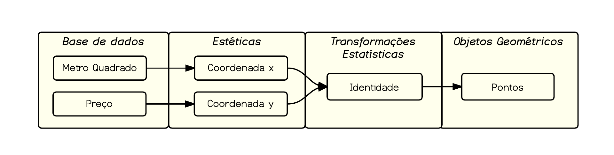
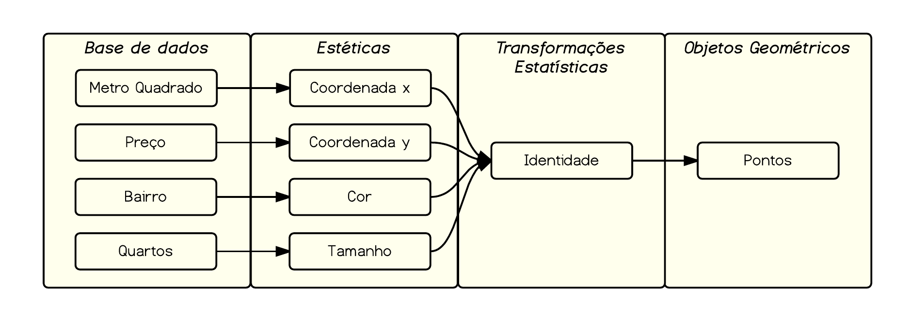
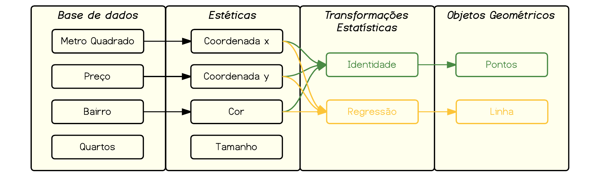

```{r, include = FALSE, echo = FALSE}
options(width = 120)
library(ggplot2)
library(dplyr)
library(gridExtra)
library(ggthemes)
```

## Utilizando gráficos para explorar sua base de dados

Os gráficos base do R são bastante poderosos e com eles é possível fazer muita coisa. Entretanto, eles podem ser um pouco demorados para explorar dinamicamente sua base de dados. O pacote `ggplot2` é uma alternativa atraente para resolver este problema.  O `ggplot2` é um pouco diferente de outros pacotes gráficos pois não segue a lógica de desenhar elementos na tela; ao invés disso, a sintaxe do `ggplot2` segue uma "gramática de gráficos estatísticos" baseada no [Grammar of Graphics de Wilkinson (2005)](http://amzn.to/1UOfLUi). 

No começo, pode parecer um pouco diferente essa forma de construir gráficos. Todavia, uma aprendidos os conceitos básicos da gramática, você vai pensar em gráficos da mesma forma que pensa numa análise de dados, construindo seu gráfico iterativamente, com visualizações que ajudem a revelar padrões e informações interessantes gastando poucas linhas de código. É um investimento que vale a pena.

Nesta seção, faremos uma breve introdução ao pacote `ggplot2`, destacando seus principais elementos. Para um tratamento mais aprofundado, recomenda-se [o livro do Hadley Wickham](http://amzn.to/1KqeNbP).

Antes de continuar, você precisa instalar e carregar os pacotes que vamos utilizar nesta seção. Além do próprio `ggplot2`, vamos utilizar também os pacotes `ggthemes` e `gridExtra`. 

```{r, eval = FALSE}
# Instalando os pacotes (caso não os tenha instalados)
install.packages(c("ggplot2", "ggthemes", "gridExtra"))

# Carregando os pacotes
library(ggplot2)
library(ggthemes)
library(gridExtra)
```

Também vamos utilizar uma base de dados de anúncio de imóveis de Brasília que você pode [baixar aqui]("https://dl.dropboxusercontent.com/u/44201187/imoveis.rds") ou carregar com o comando abaixo. Vamos utilizar apenas os dados de venda.

```{r}
# Carrega arquivo
arquivo <- url("https://dl.dropboxusercontent.com/u/44201187/imoveis.rds")
con <- gzcon(arquivo)
dados <- readRDS(con)
close(con)

#  Filtra apenas para venda
venda <- dados[dados$tipo == "venda", ]
```

## A "gramática dos gráficos"

Mas o que seria essa gramática de gráficos estatísticos? Podemos dizer que um gráfico estatístico é um **mapeamento** dos dados para propriedades **estéticas** (cor, forma, tamanho) e **geométricas** (pontos, linhas, barras) da tela. O gráfico também pode conter **transformações estatísticas** e múltiplas **facetas** para diferentes subconjuntos dos dados. É a combinação de todas essas **camadas**  que forma seu gráfico estatístico.

Deste modo, os gráficos no `ggplot2` são construídos por meio da **adição de camadas**. 
Cada gráfico, *grosso modo*, é composto de:

- Uma base de dados (um data.frame, preferencialmente no formato **long**);
- Atributos estéticos (**aes**thetics);
- Camadas, contendo
    - Objetos **geom**étricos;
    - Transformações e**stat**ísticas;
- **Facet**as; e,
- Demais ajustes.


Vejamos um exemplo simples de **diagrama de dispersão** com os dados de preço e metro quadrado dos imóveis da nossa base de dados.

```{r, eval = FALSE}
ggplot(data = venda, aes(x = m2, y = preco)) + geom_point()
```

Traduzindo o comando acima do `ggplot2`,  nós começamos chamando a função `ggplot()` que inicializa o gráfico com os seguintes parâmetros:

- **data**: aqui indicamos que estamos usando a base de dados `venda`;
- **aes**:  aqui indicamos as **estéticas** que estamos mapeando. Mais especificamente, estamos dizendo que vamos mapear o eixo x na variável `m2` e o eixo y na variável `preco`.

Em seguida, adicionamos um objeto geométrico:

- **geom_point()**: estamos falando ao `ggplot` que queremos adicionar o ponto como objeto geométrico.

Com relação às transformações estatísticas, neste caso não estamos realizando nenhuma. Isto é, estamos plotando os dado sem quaisquer modificações. Em termos esquemáticos, nós estamos fazendo o seguinte mapeamento:



O que resulta no seguinte gráfico:

```{r, echo = FALSE}
ggplot(data = venda, aes(x = m2, y = preco)) + geom_point()
```

### aes: mapeando cor, tamanho, forma etc

Um gráfico no plano tem apenas duas coordenadas, `x` e `y`, mas nossa base de dados tem, em geral, vários colunas... como podemos representá-las? Uma forma de fazer isso é mapear variáveis em outras propriedades estéticas do gráfico, tais como **cor**, **tamanho** e **forma**. Isto é, vamos expandir as variáveis que estamos meapeando nos **aes**thetics. 

Para exemplificar, vamos mapear cada bairro em uma cor diferente e o número de quartos no tamanho dos pontos. 

```{r, eval = FALSE}
ggplot(data = venda, aes(x = m2, y = preco, color = bairro, size = quartos)) + 
  geom_point()
```
Nosso esquema anterior ficaria da seguinte forma.



E o gráfico resultante:

```{r, echo = FALSE}
ggplot(data = venda, aes(x = m2, y = preco, color = bairro, size = quartos)) + 
  geom_point()
```

Note que este gráfico revela aspectos diferentes da base de dados, como alguns registros possivelmente errados (imóvel com 30 quartos) e concentração de imóveis grandes em determinados bairros.

#### Mapear é diferente de determinar

Uma dúvida bastante comum quando as pessoas começam a aprender o `ggplot2` é a diferença entre mapear variáveis em certo atributo estético e determinar certo atributo estético.

Quando estamos mapeando variáveis, fazemos isso **dentro** do comando `aes()`. Quando estamos apenas mudando a estética do gráfico, sem vincular isso a alguma variávei, fazemos isso **fora** do comando `aes()`.

Por exemplo, no comando abaixo mudamos a cor, o tamanho e a forma dos pontos do scatter plot. Entretanto, essas mudanças foram apenas cosméticas e não representam informações de variáveis da base de dados e, portanto, não possuem legenda.

```{r}
# muda o tamanho, a cor e a forma dos pontos
# note que não há legenda, pois não estamos 
# mapeando os dados a atributos estéticos
ggplot(data = venda, aes(x = m2, y = preco)) + 
  geom_point(color = "darkblue", shape = 21, size = 5)
```

## geoms: pontos, retas, boxplots, regressões

Até agora vimos apenas o `geom_poin()`, mas o `ggplot2` vem com vários **geoms** diferentes e abaixo listamos os mais utilizados:

Tipo de  Gráfico                        | **geom** 
----------------------------------------|--------------
scatterplot (gráfico de dispersão)      |`geom_point()`
barchart (gráfico de barras)            |`geom_bar()`
boxplot                                 |`geom_boxplot()`
line chart (gráfico de linhas)          |`geom_line()`
histogram (histograma)                  |`geom_histogram()`
density   (densidade)                   |`geom_density()`
smooth    (aplica modelo estatístico)   |`geom_smooth()`

Aqui, em virtude do espaço, mostraremos apenas um exemplo de gráfico de densidade e boxplot. Experimente em seu computador diferentes **geoms** na base de dados de imóveis. 

```{r, eval = FALSE}
# Density
ggplot(data = venda, aes(x = preco)) + geom_density(fill = "darkred")

# Boxplot
ggplot(data = venda, aes(x = bairro, y = preco)) + 
  geom_boxplot(aes(fill = bairro))
```

## Combinando aes e geom
Os gráficos do `ggplot2` são construídos em etapas e podemos combinar uma série de camadas compostas de **aes** e **geoms** diferentes, adicionando informações ao gráfico iterativamente. 

Toda informação que você passa dentro do comando inicial `ggplot()` é repassada para os `geoms()` seguintes. Assim, as estéticas que você mapeia dentro do comando `ggplot()` valem para todas as comadas subsequentes; por outro lado, as estéticas que você mapeia dentro dos **geoms** valem apenas para aquele **geom** especificamente. Vejamos um exemplo.

O comando abaixo mapeia o bairro como cor dentro do comando `ggplot()`. Dessa forma, tanto nos pontos `geom_point()`, quanto nas regressões `geom_smooth()` temos cores mapeando bairros, resultando em várias regressões diferentes.

```{r, eval = FALSE}
# aes(color) compartilhado
ggplot(venda, aes(m2, preco, color = bairro)) + 
  geom_point() + 
  geom_smooth(method = "lm") 
```



```{r, echo = FALSE}
# aes(color) compartilhado
ggplot(venda, aes(m2, preco, color = bairro)) + 
  geom_point() + 
  geom_smooth(method = "lm") 
```

Mas e se você quisesse manter os pontos com cores diferentes com apenas uma regressão para todas observações? Neste caso, temos que mapear os bairros nas cores **apenas** para os pontos. Note que no comando a seguir passamos a estética `color = bairro` apenas para `geom_poin()`.

```{r, eval = FALSE}
# aes(color) apenas nos pontos
ggplot(venda, aes(m2, preco)) + 
  geom_point(aes(color = bairro)) + 
  geom_smooth(method = "lm") 
```


```{r, echo = FALSE}
# aes(color) apenas nos pontos
ggplot(venda, aes(m2, preco)) + 
  geom_point(aes(color=bairro)) + 
  geom_smooth(method="lm") 
```

### Revelando padrões

A combinação simples de estéticas e formas geométricas pode ser bastante poderosa para revelar padrões interessantes nas bases de dados. Vejamos um caso ilustrativo.

#### Cilindradas, cilindros e Milhas por Galão

A base de dados `mpg` contém informações sobre eficiência no uso de combustível para diversos modelos de carro de 1999 a 2008. Vejamos um scatter plot relacionando cilindradas e consumo medido por milhas por galão:

```{r}
ggplot(mpg, aes(displ, hwy)) + geom_point()
```

A imagem parece revelar uma relação não linear entre cilindradas e milhas por galão. Vejamos, todavia, o mesmo gráfico mapeando o número de cilindros nas cores:

```{r}
# Como cyl é originalmente do tipo numérico, convertemos para factor
ggplot(mpg, aes(displ, hwy, col = factor(cyl))) + 
  geom_point() + 
  geom_smooth(method = "lm")
```

Note que o gráfico parece revelar que, uma vez condicionada ao número de cilindros, a relação entre cilindradas e milhas por galão é razoavelmente linear!

### Adicionando facetas

No `ggplot2()`, você pode dividir o gráfico em diversos subgráficos utilizando variáveis categóricas. Vejamos um exemplo utilizando `facet_wrap()`.

```{r}
ggplot(venda, aes(m2, preco)) + 
  geom_point(aes(col = factor(quartos))) + 
  geom_smooth(method = "lm") + 
  facet_wrap(~bairro) 
```

Outro exemplo

### Personalizando seu o gráfico 

Depois de chegar em um gráfico interessante, você provavelmente vai querer personalizar detalhes estéticos deste gráfico para apresentá-lo ao público. No `ggplot2` é possível fazer o ajuste fino de diversos elementos do seu gráfico e o detalhamento disso fugiria ao escopo deste livro.

Entretanto, vejamos um exemplo de histograma com a personalização de alguns elementos, adicionando *labels*, *títulos*, e mudando o *fundo* para branco:

```{r}
media <- mean(log(venda$preco))
dp <- sd(log(venda$preco))

ggplot(data = venda, aes(x = log(preco))) + 
  geom_histogram(aes(y = ..density..), binwidth = 0.3, 
                 fill = "lightblue", col = "black", alpha = 0.5) +
  stat_function(fun = dnorm, args = list(mean = media, sd = dp), 
                color = "red") +
  geom_rug() + # adiciona rug no eixo x
  xlab("Log do Preço") + # adiciona descrição do eixo x
  ylab("Densidade") + # adiciona descrição do eixo y
  ggtitle("Histograma Preços de Imóveis") + # adiciona título
  theme_bw() # adciona tema "Black and White"
```

Ficou bonito, não?

#### Temas pré prontos - ggthemes

O pacote `ggthemes` já vem com vários temas pré-programados, replicando formatações de sites como [The Economist](http://www.economist.com), [The Wall Street Journal](http://www.wsj.com), [FiveThirtyEight](http://fivethirtyeight.com), ou de outros aplicativos como o [Stata](http://www.stata.com), [Excel](https://office.live.com/start/Excel.aspx) entre outros. Esta é uma forma rápida e fácil de adicionar um estilo diferente ao seu gráfico.

Experimente com os temas abaixo  (gráficos omitidos aqui):
```{r, fig.show='hide'}
grafico <- ggplot(mpg, aes(displ, hwy, col = factor(cyl))) + 
  geom_point() + 
  geom_smooth(method = "lm", se = F) + 
  ggtitle("Cilindradas, cilindros e Milhas por Galão") + 
  ylab("Milhas por galão") + 
  xlab("Cilindradas")

# Gráfico original
grafico 

# Tema "The Economist" com respectiva escala de cores
grafico + theme_economist() + scale_color_economist()

# Tema "The Wall Street Journal" com respectiva escala de cores
grafico + theme_wsj() + scale_color_wsj()

# Tema "Excel" com respectiva escala de cores
grafico + theme_excel() + scale_color_excel()

# Tema "fivethirtyeight"
grafico + theme_fivethirtyeight() 

# Tema "highcharts" com respectiva escala de cores
grafico + theme_hc()  + scale_color_hc()

# Tema "Tufte" 
grafico + theme_tufte() 

# Tema "Stata" com respectiva escala de cores
grafico + theme_stata() + scale_color_stata()
``` 

#### Vários gráficos juntos
Por fim, uma última dica e como colocar vários gráficos juntos com a função `grid.arrange()`. 

```{r, fig.width=15, fig.height=8}
g1 <- grafico + theme_fivethirtyeight() 
g2 <- grafico + theme_hc() + scale_color_hc()
g3 <- grafico + theme_tufte() 
g4 <- grafico + theme_stata() + scale_color_stata()
grid.arrange(g1, g2, g3, g4)
```

